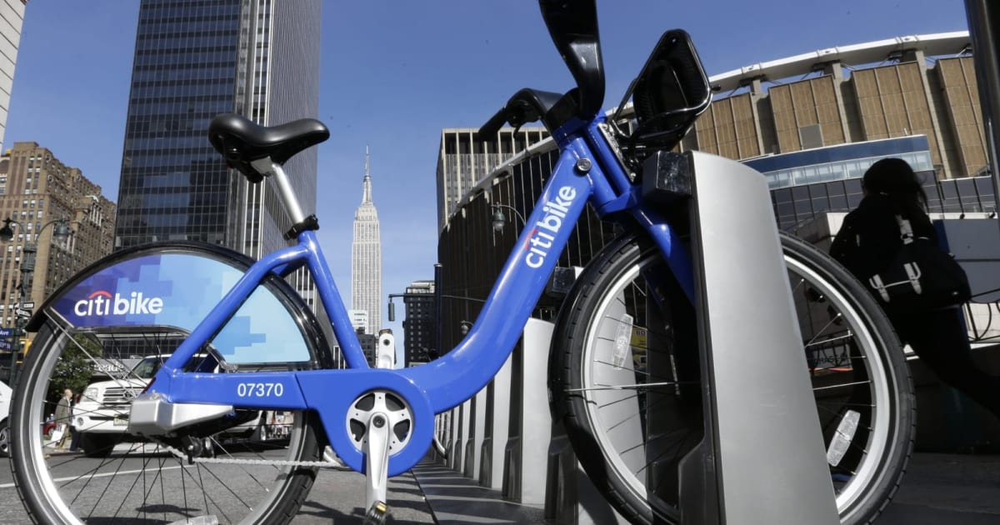

# NewYork CitiBike Program

## Background

## Background

A new lead analyst for the [New York Citi Bike](https://en.wikipedia.org/wiki/Citi_Bike) Program has been given the responisiblity for overseeing the largest bike-sharing program in the United States. The analyst is expected to generate regular reports for city officials looking to publicize and improve the city program.

Since 2013, the Citi Bike Program has implemented a robust infrastructure for collecting data on the program's utilization. Each month, bike data is collected, organized, and made public on the [Citi Bike Data](https://www.citibikenyc.com/system-data) webpage.

However, while the data has been regularly updated, the team has yet to implement a dashboard or sophisticated reporting process. City officials have questions about the program, so the first task on the job is to build a set of data reports to provide the answers.

## Instructions

In this assignment, our task is to aggregate the data found in the Citi Bike Trip History Logs and find two unexpected phenomena and help the analyst.

1. Design 2–5 visualizations for each discovered phenomenon (4–10 total). You may work with a timespan of your choosing. Optionally, you can also merge multiple datasets from different periods.

2. Use your visualizations (not necessarily all of them) to design a dashboard for each phenomenon. The dashboards should be accompanied by an analysis explaining why the phenomenon may be occurring. 

3. Create one of the following visualizations for city officials:

* **Basic:** A static map that plots all bike stations with a visual indication of the most popular locations to start and end a journey, with zip code data overlaid on top.

* **Advanced:** A dynamic map that shows how each station's popularity changes over time (by month and year). Again, with zip code data overlaid on the map.

* The map you choose should also be accompanied by a write-up describing any trends that were noticed during your analysis.

4. Create your final presentation.

    * Create a Tableau story that brings together the visualizations, requested maps, and dashboards.

    * Ensure your presentation is professional, logical, and visually appealing. 

# Analysis:

We were find able to find a few things /phenomena with the datasets we chose. We chose NewYork Citibike Dataset from 2019 and 2020. We wanted to see if the program had been affected in any way during covid period. We compared 2019 and 2020 datasets and came up with the following conclusions:

* First, limitations: We encountered a slow down in our tableau program due to merging 4 datasets together. 
* Once we tried to merge 2 datasets from the month of November of 2019 and 2020 , it worked more efficiently.
* We made UserType visualizations and found out that the number of customer and subsribers had increased a significant amount in a year.
* The Trips duration and number of trips also increased. 
* Popular rides days before covid were Fridays in 2019 and Saturdays of November 2020
* The most popular start to stop location for 2020 that had a sum of trip duration of 2.4 M was Clay Ave & Claremont Pkwy and W 159 St & Edgecombe Ave.
  These locations have parks and many restaurants and shops for people to bike or walk to. 
* The Most Popular End location was 12 Ave & W 40 St. The hudson river and sight seeing cruises are close to this end location. this makes it the most popular end location for travellers to come to and go sight seeing and enjoy the restaurants at a walking distance. 
* November of 2020, there is an increase number of rental days and the duration of bike rented, as compared to the 2019 data of November.
* We also found out that the majority of the bikes were in the made in 1960's as the number of people using those bikes were more as compared to the newer bikes birth year. We had 2 highest points in our visualization. one for the year 1969 and the other for 1990. We could also see that tha sum of tripduration had also increase by 2 million from november 2019 to 2020. 
* The only limitations for this dataset was people were not honest about their details. We were not able to find a ratio for which gender would prefer riding a bike than walking, using a bus or driving in NewYork.

In conclusion we can say that Covid did not decrease the ridership program but instead it made people go out more and be more outdoors. It increased the ridership subscription as well as its customers and also the amount of days people renting the bikes and riding it long distances.  
